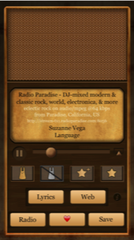
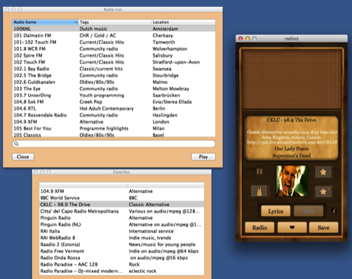

Short Wave
======

[Short Wave](http://www.iltofa.com/radioz/index.html) is an application that streams Internet Radios on your iPhone, iPad and/or Macintosh. A searchable radio’s list allows you to select and listen your preferred channels worldwide. Karotz and Nabaztag are supported as listening devices as well.

The application is localized in English, Italian and French and used to be on the App Store for iOS and Mac App Store for OS X. I simply don't have time anymore for it, so I released the code under the MIT license for anyone willing to prosecute the app.

The application currently requires Xcode 4.x but it can be easily compiled under Xcode 5. It is a skeumorphic application, so compiling it with iOS7 SDK will require some hacks on the UI (especially for the UISegmentedControls).

The app is dependent on the [Parse SDK](https://www.parse.com) for the favorites saving (you'll need a registered app to use it), iCloud for the saved songs sharing between device (it will happily work without iCloud, though) and a [Karotz store](http://www.karotz.com/appz/home) application for Karotz streaming.

**Screenshots**

iPhone: 

Macintosh: 

**License**

The source code is @2014 Giacomo Tufano and it's licensed under the MIT license (see the LICENSE file for details). The radio db (a bit outdated, unfortunately) is in the project as a CSV file.